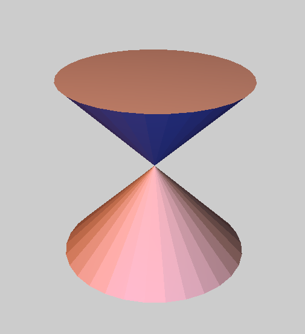
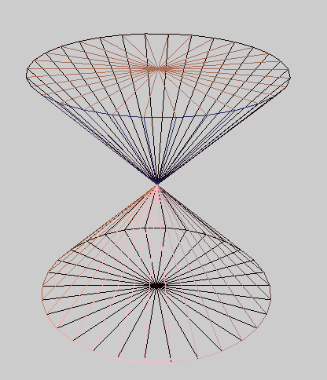
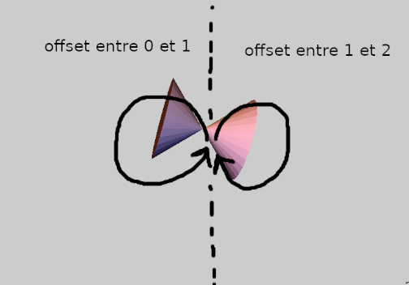
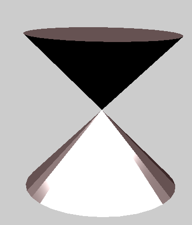
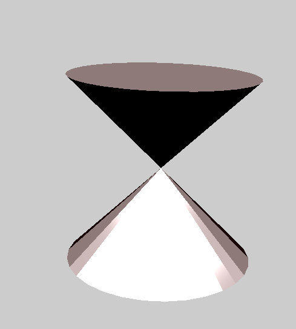
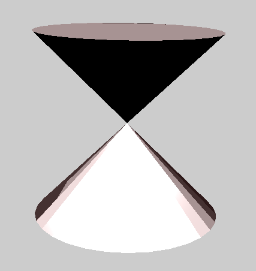
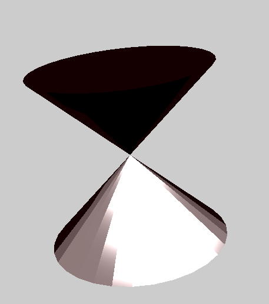

# Rapport
## Exercice 1 : Modélisation
Pour tracer un diabolo, on pose un point en `(0,0,0)` et deux points en `(0,h/2,0)` et `(0,-h/2,0)`. `h` étant la taille du diabolo, ces deux derniers points sont positionnés au centre des futurs cercles qui serviront de base à notre diabolo. La taille sera bien de `h = 2*h/2`.

Enfin on trace les deux cercle autour des deux points centraux à ces cercles. L'équation qui permet d'obtenir les points composant un tel cercle est, pour **n** étant la résolution du cercle et pour i de 0 à n-1:
- `x = cos(2*PI * i/n)`
- `y = h/2 ou -h/2`
- `z = sin(2*PI * i/n)`

Enfin on ajoute les triangles au mesh. On va relier le centre à chaque paire de sommets consécutives dans chaque cercle, et faire de même entre le centre d'un cercle et ses sommets.
On a ainsi **4n** triangles qui composent notre forme.

Voici le résultat :
| Diabolo | Diabolo en wireframe |
|---------|----------------------|
|||

## Exercice 2 : Animation

### Rotation autour de x et z

Afin de faire une rotation autour de x d'un certain angle, on définit la matrice `Rx` telle que :
```
Rx = (1, 0, 0,
    0, cos(angle), -sin(angle),
    0, sin(angle), cos(angle));
```   
De même, pour faire une rotation autour de l'axe z, on peut définir la matrice `Rz` telle que :
```
Rz = (cos(angle), -sin(angle), 0,
    sin(angle), cos(angle), 0,
    0, 0, 1);
```
Soit R la matrice de rotation que l'on va appliquer, elle est égale à `R = MId * Rx * Rz`,\
où MId est la matrice identité.

La variable angle est modifiée avec la touche R/r et permet de faire l'animation voulue.

### Faire tourner l'objet en 8
Afin de faire tourner l'objet en 8, on doit lui faire suivre une trajectoire qui est composée dun cercle et d'un autre cercle inversé.

La variable `offset` contrôle l'avancement dans cette animation. On force cette variable à évoluer **entre 0 et 2**, et si elle est inférieure à 1, on calculera une position sur un cercle à partir de `offset`, sinon on calculera la position sur un cercle inversé par rapport au premier cercle.

Les coordonnées de ces deux cercles, de rayon r sont :
- **Cercle normal :**
  - `x = cos(2*PI * offset)*r`
  - `z = sin(2*M_PI * offset)*r`
- **Cercle inversé :**
  - `x = (2+cos((2*PI * offset)+PI))*r`
  - `z = sin((2*PI * offset)+PI)*-r`
    - `+2` décalle le 2e cercle de 2*r à droite (car on fait *r à la fin, 2 correspond à la taille d'un cercle neutre)\
    - `+PI` permet de déplacer le départ du cercle à gauche au lieu de à droite\
    - et enfin `multiplier par -r` au lieu de r dans la 2e coordonnée va inverser le sens de rotation du 2e cercle

Ainsi on a bien une animation en 8 :



### Animation continue

Afin de mettre en place une animation en continu, on ajoute dans la fonction idle() l'évolution des variables `offset` et `angle` qui contrôlent notre animation. Afin de ne pas les mettre à jour trop souvent, on ajoute une condition qui ne le met à jour que si 1/60 seconde s'est écoulée pour obtenir une animation en 60 images par seconde.

## Exercice 3 : Rendu

### Toon shading à n niveaux

Afin de calculer le toon shading pour `levels` niveaux, la ligne suivante permet d'obtenir le même résultat qu'une suite de if / else de taille `levels` :

```glsl
dotLN = floor((dotLN + 1.0) * (levels/2.0)) / (levels/2.0) - 1.0;
```
Après nivellation du dotLN entre les `levels` niveaux, on poursuit le calcul du shader comme d'habitude avec ce nouveau dotLN.

Voici le résultat : 
| 3 niveaux | 4 niveaux | 5 niveaux |
|-----------|-----------|-----------|
||||

### Ajout d'un bord noir

Afin d'ajouter un bord noir pour un seuil `S`, lorsque le produit scalaire entre N et V est inférieur à celui-ci, on ne calcule pas le shading et on met directement une couleur noire pour cette partie de l'objet. Cela se traduit en code par :

```glsl
double S = 0.3;
if (dot(N, V) < S) { // Seuil < 0.3 : contours
    gl_FragColor = vec4(0, 0, 0, 1); // Noir
} else {
  // Calcul du toon shading
}
```
Voici le résultat avec 3 niveaux de toon shading et des bords noirs pour un seuil = 0.3 :



