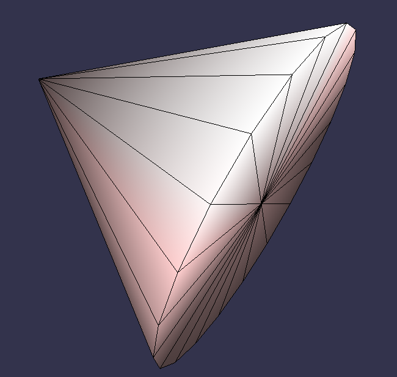
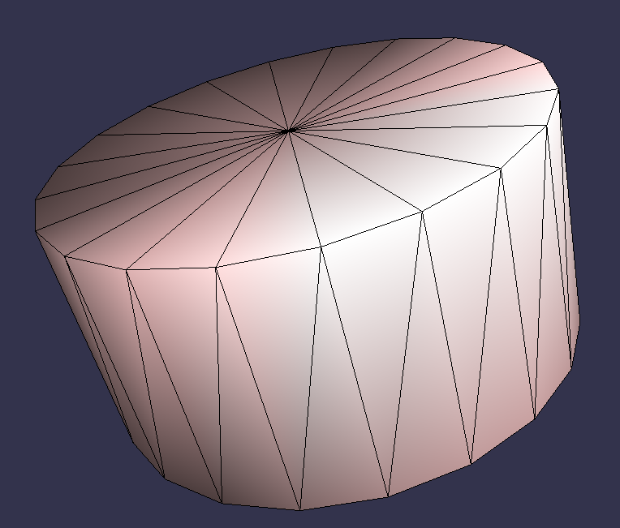
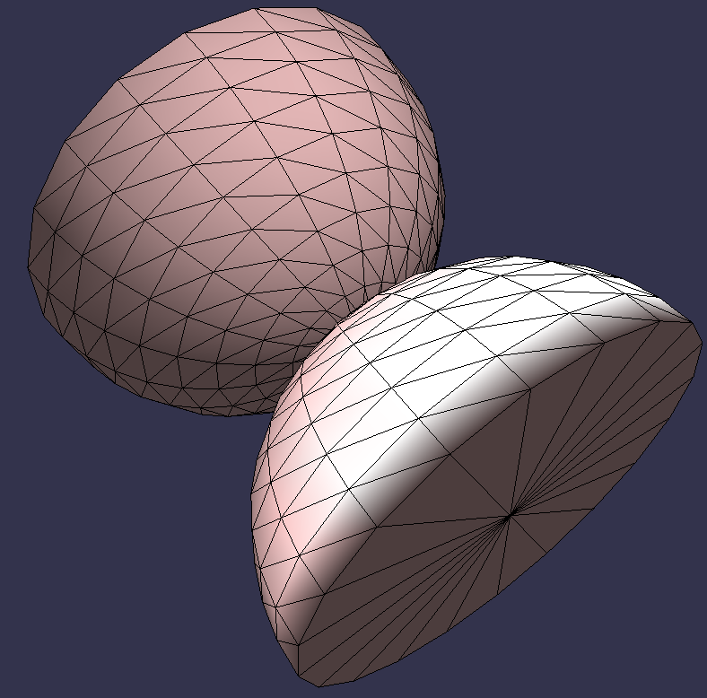
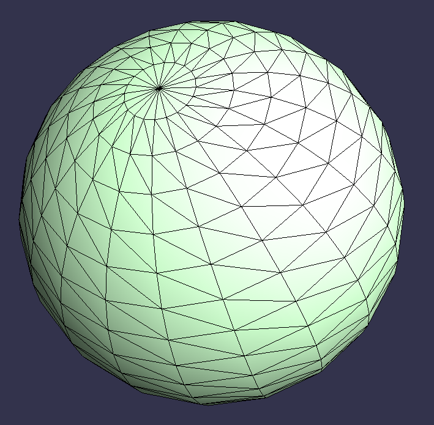
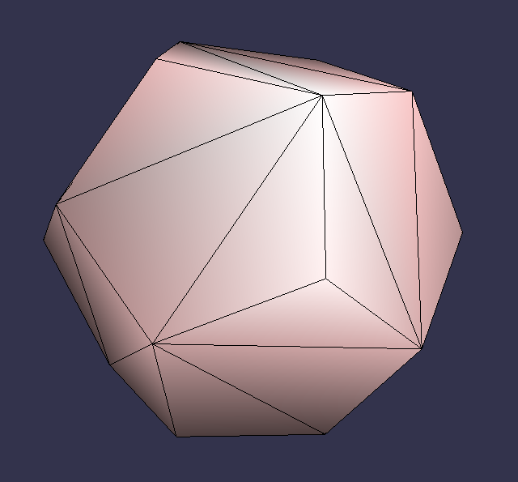
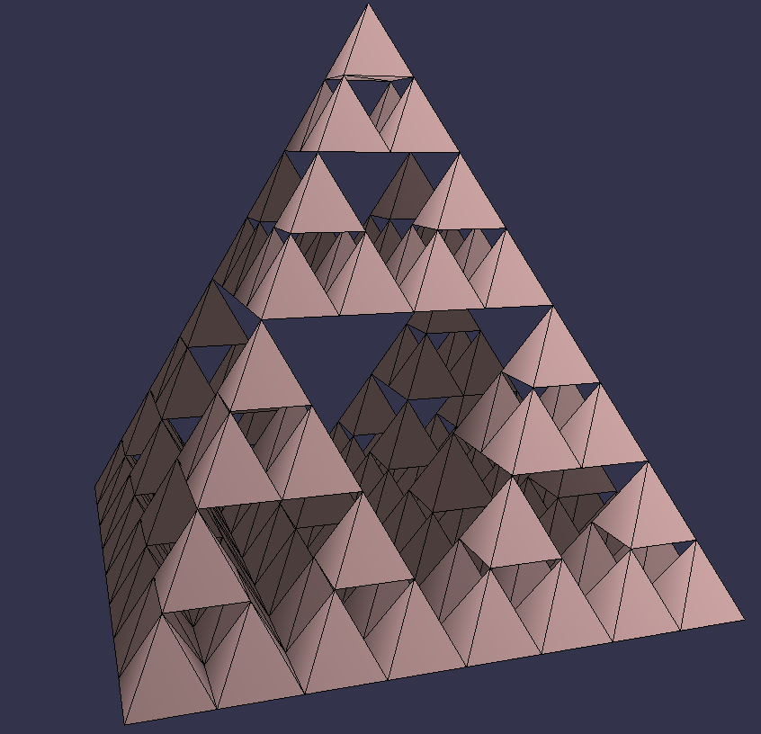

# HAI605I_tp
Code derived from GMINI
-----------

Author: Tamy Boubekeur (https://perso.telecom-paristech.fr/boubek/)

Description
------------

gmini is a small 3D "tester" program, with minimum interaction. 
Just replace the loading and/or drawing function for testing your algorithm, or visualize your particular format.

Installation
------------

This is an alpha release, you may have to set up the makefile with
your lib/include path and options.

Compilation 
------------
make

Execution 
------------
./tp

Keys
------------
- **n** : toggle normal display
- **w** : toggle display mode (wireframe / lighted / not lighted / wireframe + lighted)
- **1** : toggle display of the loaded model
- **2** : toggle display of the generated sphere
  - **\-** : decrease the number of meridians and parallels of the generated sphere or the Sierpinski Pyramid's depth
  - **\+** : increase the number of meridians and parallels of the generated sphere or the Sierpinski Pyramid's depth
- **3** : toggle display of the additionnal meshes
- **S/s** : cycle through the additionnal meshes (Cone, Diabolo, Dodecahedron, Sierpinski Pyramid, Cylinder)
- **b** : toggle the limit for the Sierpinski Pyramid's depth, reactivating it will bring the depth to the default value
- **Middle mouse button + move** : rotate the scene
- **Left mouse button + move** : rotate the scene

Preview the shapes :
| Cone    | Cylinder | Diabolo |
|------|------|------|
||||

| Sphere | Dodecahedron | Pyramid |
|------|------|------|
||||